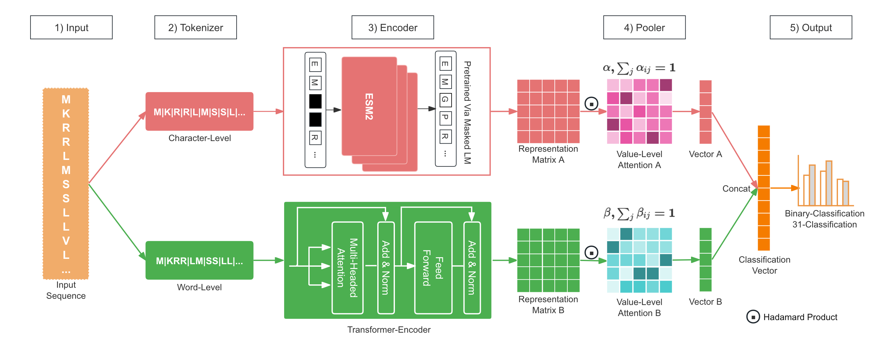
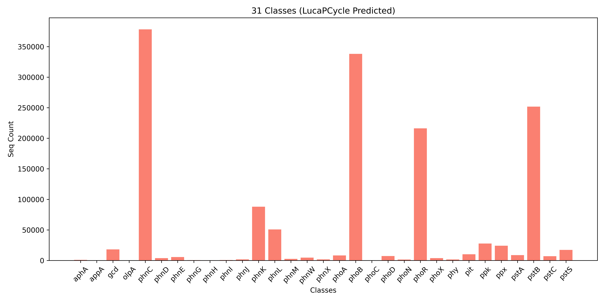
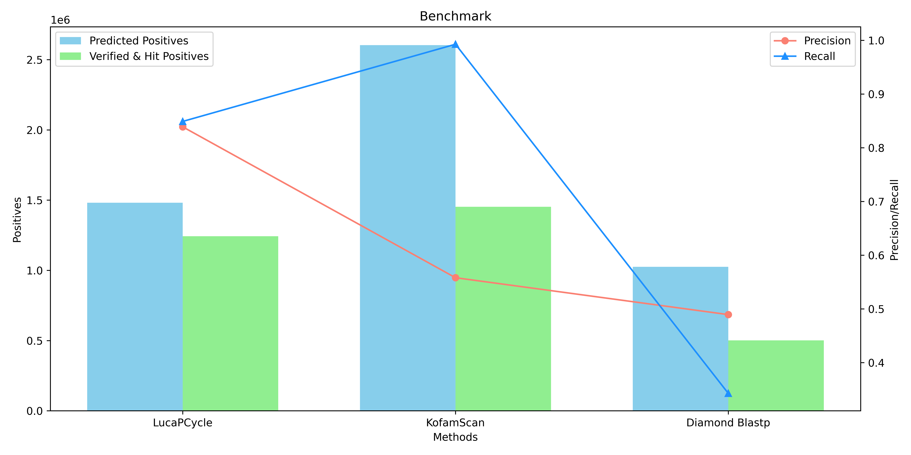

# LucaPCycle   
We developed a dual-channel model named LucaPCycle, based on the raw sequence and protein language large models, to predict whether a protein sequence has phosphate-solubilizing functionality and its specific type among the 31 fine-grained functions.        

We constructed two models, including an identification model(binary classification) and a fine-grained classification of specific phosphate-solubilizing functional types(31 classification).

## 1. Model Architecture     

<center>


**Fig.1 LucaPCycle.**  
</center>


## 2. Environment Installation
### step1: update git
#### 1) centos
sudo yum update     
sudo yum install git-all

#### 2) ubuntu
sudo apt-get update     
sudo apt install git-all

### step2: install python 3.9
#### 1) download anaconda3
wget https://repo.anaconda.com/archive/Anaconda3-2022.05-Linux-x86_64.sh

#### 2) install conda
sh Anaconda3-2022.05-Linux-x86_64.sh
##### Notice: Select Yes to update ~/.bashrc
source ~/.bashrc

#### 3) create a virtual environment: python=3.9.13
conda create -n lucapcycle python=3.9.13


#### 4) activate lucapcycle
conda activate lucapcycle

### step3:  install other requirements
pip install -r requirements.txt -i https://pypi.tuna.tsinghua.edu.cn/simple    

## 3. Inference     

### TrainedCheckPoint   
Trained LucaPCycle Checkpoint FTP: <a href='http://47.93.21.181/lucapcycle/TrainedCheckPoint/'>TrainedCheckPoint for LucaPCycle</a>

**Notice**    
The project will download automatically LucaPCycle Trained-CheckPoint from **FTP**.

When downloading automatically failed, you can manually download:

Copy the **TrainedCheckPoint Files(`models/` + `logs/`)** from <href> http://47.93.21.181/lucapcycle/TrainedCheckPoint/* </href> into the project.  

### Usage    
Firstly, predict whether a sequence has phosphate-solubilizing functionality.  
The inference script: **`src/prediction.py`** or  **`src/prediction.sh`**    

```python prediction.py -h``` for **help**
#### Binary Classification  
```shell
cd src/
export CUDA_VISIBLE_DEVICES="0,1,2,3"
python prediction.py \
    --fasta ../test_data/examples.fasta \
    --llm_truncation_seq_length 4096 \
    --model_path .. \
    --save_path ../predicted_results/test_data/examples_predicted.csv \
    --dataset_name extra_p_2_class_v2 \
    --dataset_type protein \
    --task_type binary_class \
    --task_level_type seq_level \
    --model_type lucaprot \
    --input_type seq_matrix \
    --time_str 20240120061735 \
    --step 955872 \
    --threshold 0.2 \
    --per_num 1000 \
    --gpu_id 0
```

#### 31 Classification      
Then, for the sequences predicted to be positive in the **2-classification** inference, the fine-grained classification of specific phosphate-solubilizing functional types(**31 classes**) is further predicted.      
```shell
cd src/
export CUDA_VISIBLE_DEVICES="0,1,2,3"
python prediction.py \
    --fasta ../test_data/example_positives.fasta \
    --llm_truncation_seq_length 4096 \
    --model_path .. \
    --save_path ../predicted_results/test_data/example_positives_fine_grained_predicted.csv \
    --dataset_name extra_p_31_class_v2 \
    --dataset_type protein \
    --task_type multi_class \
    --task_level_type seq_level \
    --model_type lucaprot \
    --input_type seq_matrix \
    --time_str 20240120061524 \
    --step 294536 \
    --per_num 1000 \
    --gpu_id 1
```

#### Parameters   
1) Input data parameters:     
* fasta: `Path`, the input fasta filepath(for a batch samples)   
* seq_id: `str`, the seq id(for one sample)     
* seq: `str`, the sequence(for one sample)      
* save_path: `Path`, the saved dir path of the batch samples predicted results(only for batch prediction)          

2) Trained LucaPCycle checkpoint parameters:      
  * model_path: `Path`, model dir path，default: `../` (meaning the checkpoint in the project)        
  * dataset_name: `str`, the checkpoint version: `extra_p_2_class_v2`(2-classification) or `extra_p_31_class_v2`(31-classification)        
  * dataset_type: `str`, only `protein`, default: `protein`    
  * task_type: `str`, the trained task type: `binary_class`(2-classification) or `multi_class`(31-classification)      
  * task_level_type: `str`, sequence-level tasks, default: `seq-level`   
  * model_type: `str`, the model type, default: `lucaprot`   
  * input_type: `str`, the model channels, default: `seq_matrix`      
  * time_str: `str`, the trained checkpoint running time str: `20240120061735`(2-classification) or `20240120061524`(31-classification)     
  * step: `int`, the checkpoint step: `955872`(2-classification) or `294536`(31-classification)

3) Running parameters: 
  * topk: `int`, the topk labels when inferring 31-classification, default: `None`(meaining k=1)     
  * llm_truncation_seq_length: `int`, the max seq length to truncation(depends on the length of your sequence and the size of your GPU memory. default: `4096`           
  * per_num: `int`, the print progress is determined by how many sequences are predicted.  default: `1000`          
  * threshold: `float`, the threshold for binary-classification, default: `0.1`, (positive>=threshold, negative<threshold, small value leads to high recall, and large value to high precision)     
  * gpu_id: `int`, the gpu id to use(-1 for cpu), default: `-1`          

## 4. Model Building Dataset    
For the two models, we divided the dataset into the training, validation, and testing sets, which were used for model fitting, model finalization (based on the best F1-score training iteration), and performance reporting, respectively.   

### Binary Classification      
The training, validation, and testing sets of **binary-classification** in **`dataset/extra_p_2_class_v2/`**     
 

### 31 Classification      
The training, validation, and testing sets of **fine-grained 31-classification** in **`dataset/extra_p_31_class_v2/`**      

## 5. Model Building    
### Training Binary Classification Model   
The script of **binary-classification** model building is **`src/training/run_extra_p_2_class_subword_v2.sh`**      

### Training 31 Classification Model     
The script of **fine-grained 31-classification** model building is **`src/training/run_extra_p_31_class_subword_v2.sh`**      


## 6. Data Availability    
### 1) Data for Model Building     
The model building dataset in **`dataset/`** or <a href='http://47.93.21.181/lucapcycle/dataset'>Dataset FTP</a>.

The raw data of LucaPCycle building in **`data/`** or <a href='http://47.93.21.181/lucapcycle/data'>Raw Data FTP</a>, 
where folder **`31P_genes/`** is fasta for each of the 31 fine-grained phosphate-solubilizing types, 
and the file **`cold_spring_sample_50.csv`** is the non-redundancy sequences(including positives and negatives) using the CD-HIT tool with 50% sequence identity.  

### 2) Large-scale Identification    
The large-scale unidentified data is in **`inference_data/`** or <a href='http://47.93.21.181/lucapcycle/inference_data'>Large-scale Unidentified Data FTP</a>, total of **151,187,265** sequences.    
The data includes 164 metagenomes and 33 metatranscriptomes,    
which is sourced from sediment samples (sediment depths: 0-68.55 mbsf; water depths 860-3005 m) collected at 16 globally distributed cold seep sites.    
These samples encompass five types of cold seeps, namely gas hydrates (n = 39), mud volcanoes (n = 7), asphalt volcanoes (n = 7), oil and gas seeps (n = 15) and methane seeps (n = 96).


The predicted results of the large-scale data are list in **`results/`** or <a href='http://47.93.21.181/lucapcycle/results'>Results FTP</a>:  
The file in the format of **`*_init*`** is the unchecked results, and the file in the format of **`*_verified*`** is the result of the verification by through three distinct methods: **ECOD Domain Analysis**, **DeepFRI v1.0.0 (Deep Functional Residue Identification)**, and **CLEAN v1.0.1 (Contrastive Learning-Enabled Enzyme Annotation)**.   

* **LucaPCycle**     
  Results in **`results/LucaPCycle/`** or <a href='http://47.93.21.181/lucapcycle/results/LucaPCycle'>LucaPCycle Results FTP</a>:   
  Resulting in **1,481,237** positive sequences.   
  The detailed predicted numbers for each class are shown below.   
  **Notice:** There may be **interesting findings**. Totaling 134,227 positive sequences(predicted by LucaPCycle) in file **`results/LucaPCycle/lucapcycle_unverifiable.fasta`** (9.06%) could not be confirmed using existing verified methods.      
  `lucapcycle_details_init.csv`:  unchecked predicted details positives by LucaPCycle(include top1 prob and label, top10 prob and label)   
  `lucapcycle_init.ids.labels` & `lucapcycle_init.fasta`: unchecked predicted positives by LucaPCycle.      
  `lucapcycle_verified.ids.labels` & `lucapcycle_verified.fasta`: checked predicted positives by LucaPCycle.   
  `lucapcycle_unverifiable.ids` & `lucapcycle_unverifiable.ids`: unverifiable predicted positives by LucaPCycle.         

  <center>
  

  **Fig.2 The Predicted Details.**        
  </center>


* **Diamond Blastp**        
  Results in **`results/Blastp/`** or <a href='http://47.93.21.181/lucapcycle/results/Blastp'>Blastp Results FTP</a>   
  `blastp_init.ids.labels` & `blastp_init.fasta`: unchecked predicted positives by Blastp.    
  `blastp_verified.ids.labels` & `blastp_verified.fasta`: checked predicted positives by Blastp.   


* **KofamScan**       
  Results in **`results/KofamScan/`** or <a href='http://47.93.21.181/lucapcycle/results/KofamScan'>KofamScan FTP</a>     
  `kofamscan_init.ids.labels` & `kofamscan_init.fasta`: unchecked predicted positives by KofamScan.     
  `kofamscan_verified.ids.labels` & `kofamscan_verified.fasta`: checked predicted positives by KofamScan.       

<center>


**Fig.3 Benchmark.**   
</center>   

### 3) Tree-Families     
<a href='http://47.93.21.181/lucapcycle/results/Tree-Families/Sequence_tree_of_APL_newick.txt'>Sequence Tree</a>          
Phylogenetic tree of alkaline phosphatase with remote homology based on protein sequences.

<a href='http://47.93.21.181/lucapcycle/results/Tree-Families/Protein_structure_tree_of_APL_newick.txt'>Structural Tree</a>      
Structure-based phylogeny of alkaline phosphatase with remote homology and reference proteins.

<a href='http://47.93.21.181/lucapcycle/results/Tree-Families/non-singleton_cluster70.faa.gz'>Families</a>    
Representatives from non-singleton P-solubilizing protein families.   


## 7. Contributor    
<a href="https://scholar.google.com.hk/citations?user=RDbqGTcAAAAJ&hl=en" title="Yong He">Yong He</a>,
<a href="https://scholar.google.com/citations?user=lT3nelQAAAAJ&hl=en" title="Zhaorong Li">Zhaorong Li</a>, 
<a href="https://scholar.google.com/citations?user=a1Evzq4AAAAJ&hl=en" title="Chuwen Zhang">Chuwen Zhang</a>, 
<a href="https://scholar.google.com/citations?hl=zh-CN&user=7c3wH8sAAAAJ&hl=en" title="Xiyang Dong">Xiyang Dong</a>      

## 8. Citation    
@article {   
Zhang2024.07.09.602434,  
author = {Zhang, Chuwen and He, Yong and Wang, Jieni and Chen, Tengkai and Baltar, Federico and Hu, Minjie and Liao, Jing and Xiao, Xi and Li, Zhao-Rong and Dong, Xiyang},      
title = {Illuminating microbial phosphorus cycling in deep-sea cold seep sediments using protein language models},   
elocation-id = {2024.07.09.602434},    
year = {2024},       
doi = {10.1101/2024.07.09.602434},        
publisher = {Cold Spring Harbor Laboratory},     
URL = {https://www.biorxiv.org/content/early/2024/07/09/2024.07.09.602434},      
eprint = {https://www.biorxiv.org/content/early/2024/07/09/2024.07.09.602434.full.pdf},       
journal = {bioRxiv}        
}   


  
